# [지금 재난] - 2023 봄학기 인터넷프로그래밍 Project

### 학번 및 이름

2017129007 김홍래

### 역할 분담

개인 프로젝트

# 매시업 아키텍처

- 모바일 브라우저가 제공하는 GeoLocation 정보
- kakao 지도 API
- 모바일 디바이스에서 찍을 수 있는 사진 정보
- 행정안전부 제공 실시간 재난문자 API

이 4가지를 매쉬업하여 **실시간으로 재난 상황을 공유할 수 있는 게시판** 웹서비스를 만들었음.

실시간 재난문자 현황 API를 통해 현재 어떤 재난이 일어났는지를 홈 화면 상단에 보여주고, 그 아래에는 게시판을 만들어서 재난 현장에 있는 사용자들이 실시간으로 현장의 상황을 공유할 수 있도록 했음. 게시물과 댓글을 통해 서로 상호작용 할 수 있기 때문에 구조 당국에게도 도움이 될 것으로 보임. 운영진은 게시판에 기부금 모금 게시물을 올려, 재난 구호에 관심 있는 사용자들과 함께 현장에 도움을 줄 수 있음.

# 전체 시스템 구성 (모듈 및 파일 소개 포함)

- 구조

  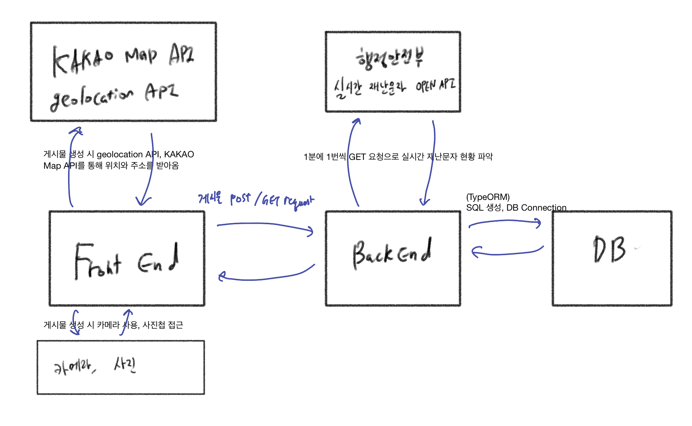

- 사용한 기술

  - FrontEnd : NextJS

  

  - BackEnd : NestJS

  
  

  - DB : PostgreSQL

  

- ERD

  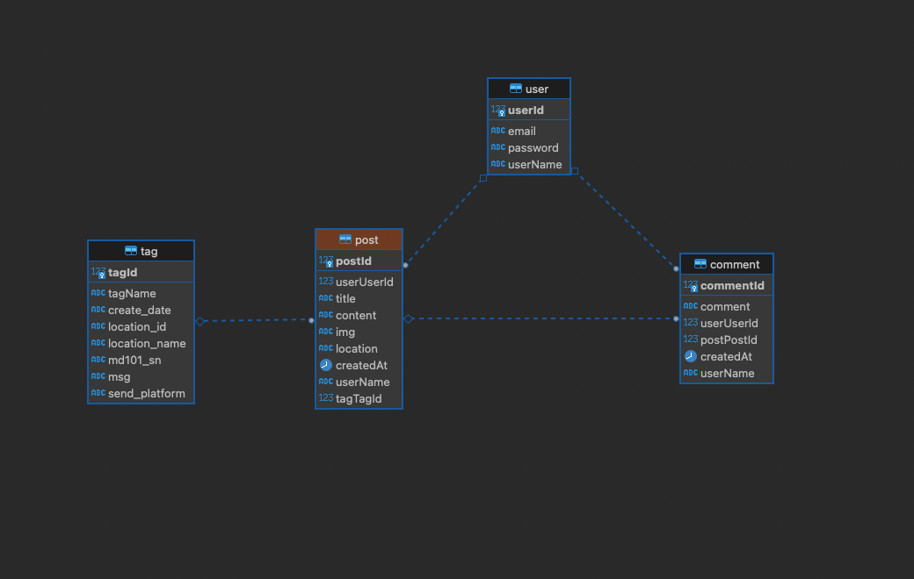
  #### 비즈니스 로직
  - 사용자는 여러 게시물을 등록할 수 있고, 여러 댓글을 달 수 있다.
  - 게시물 하나에 여러 댓글이 달릴 수 있고, 댓글이 없을 수도 있다.
  - 실시간 재난문자는 서버에서 행정안전부 api로 1분에 1번씩 GET 요청을 통해 수집되는데, 1분 전과 비교하여 변화가 있을 때에만 실시간 재난 정보가 "Tag" 엔티티에 저장한다.
  - 게시물은 하나의 Tag를 가질 수 있으며 Tag가 없을 수도 있다.

# 서비스 시나리오 별 실행 결과

- 회원가입 / 로그인

  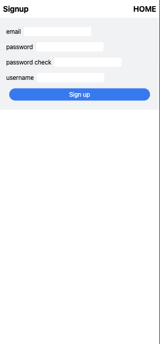
  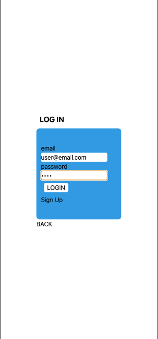

#### 홈 화면 (게시판) ("/posts")

- 화면 상단에 실시간 재난문자 현황을 3개 보여준다.
- 그 아래에는 사용자들이 등록한 게시물들을 보여준다.
- 맨 아래에는 서버에서 게시물의 갯수를 받아와 pagination을 동적으로 처리했다.
- page 숫자 버튼을 누르면, url의 query parameter 중 "?page=[__]" 부분에 값이 들어가고, 서버로 fetch가 일어난다.
- [게시물 등록] 버튼을 누르면 글쓰기 화면으로 이동한다.

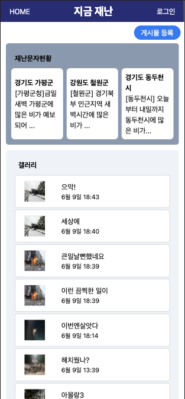

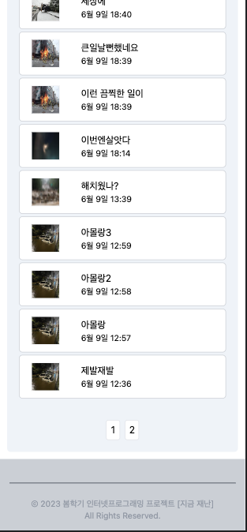

#### 글쓰기 화면 ("/posts/write")

- 상단에 [내 위치 찾기] 버튼을 누르면 geolocation API로 현 위치의 위도/경도를 받아온다.
- 또, 화면 하단에는 kakao map api를 이용한 컴포넌트에 내 위치를 볼 수 있게 했다.
- 모바일 기기에서 [파일 선택] 버튼을 누르면 저장된 사진을 업로드하거나 새롭게 사진을 찍을 수 있게 된다.
- 업로드된 사진은 바로 아래에 미리보기로 보여준다.
- 제목과 내용은 input 요소 안에 입력할 수 있다.
- 로그인을 하지 않은 사용자도 닉네임과 비밀번호를 입력하여 게시물을 등록할 수 있다.
- 게시물 등록에 성공하면 홈으로 redirect 되며, 실패하면 alert를 띄운다.

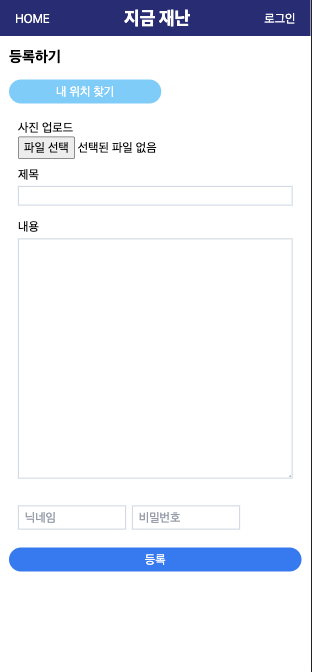
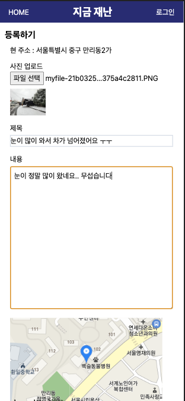
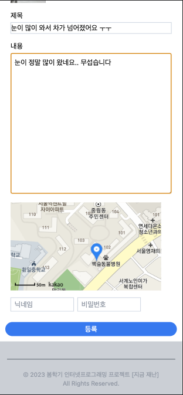

#### 게시물 detail, 댓글 등록 화면 ("/posts/[postId]")

- 다시 홈에서 게시물을 클릭하면 게시물 detail 화면으로 redirect 된다.
- 게시물의 id값을 path parameter에 넣고, 서버로 fetch가 일어난다.
- 사용자가 등록한 게시물의 더 자세한 내용과 댓글을 볼 수 있다. (홈 화면에서는 제목, 등록한 시간, 이미지 미리보기만 볼 수 있다.)
- 댓글에 필요한 input field를 모두 입력하고 [댓글 쓰기] 버튼을 클릭하면, 즉시 댓글이 생성되고 input들은 초기화된다.

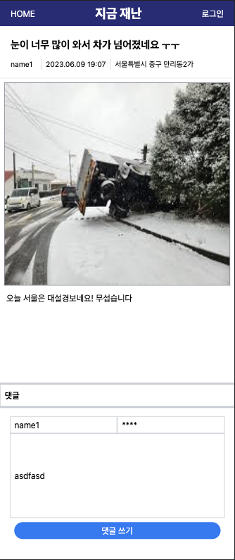
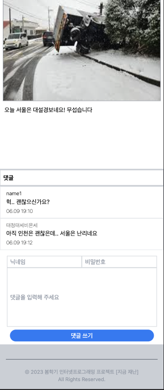

## API documentation

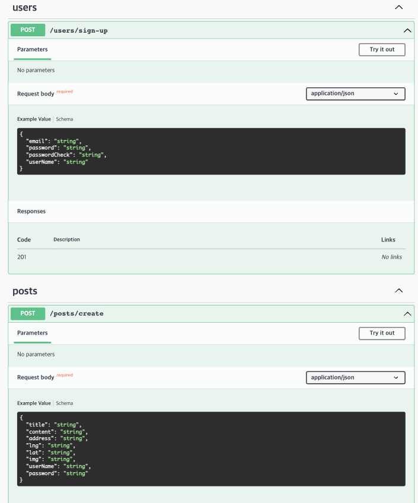
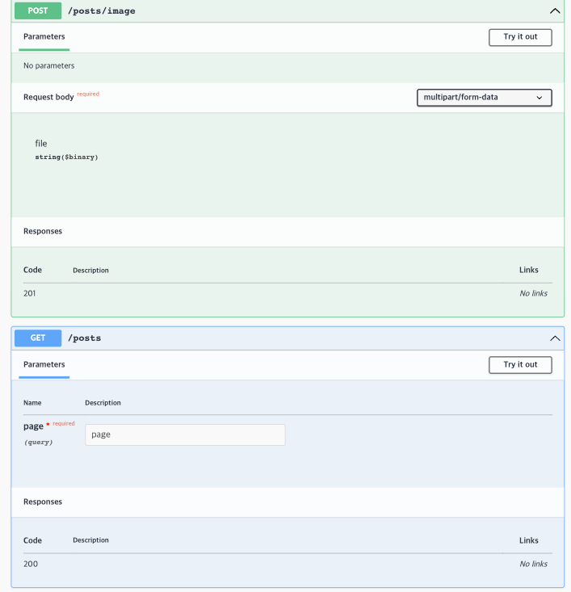

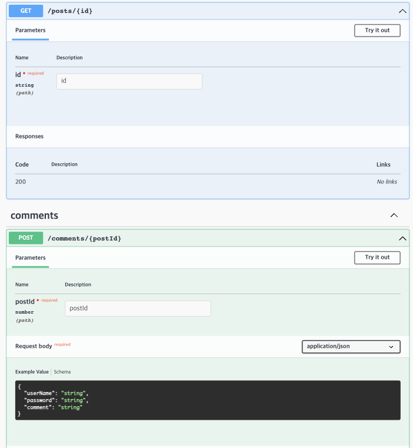
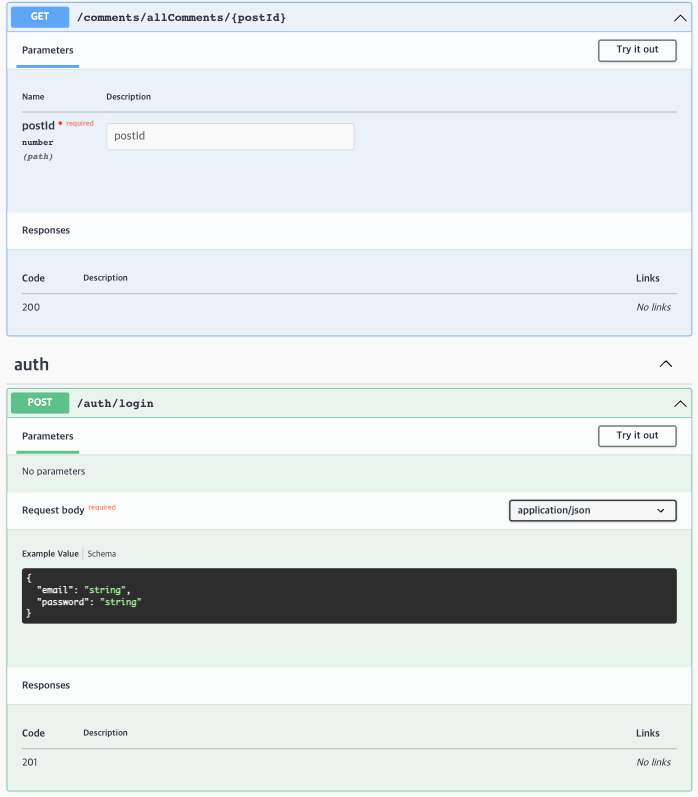

# 어려웠던 점

- 개인 프로젝트로 단기간에 처음부터 끝까지 개발하기 쉽지 않았기 때문에, 많은 것이 이미 갖춰져 있는 웹 프레임워크 (Next JS, Nest JS)를 사용했다.
- 두 프레임워크를 처음 사용했는데, 익숙해지는 것이 쉽지 않았다. chat GPT의 도움을 받아도, 코드의 구조를 파악하고 있어야 의미가 있었다.

- 모바일 데이터의 수집
  - 브라우저가 제공하는 geolocation API, 이미지/사진 업로드 API를 사용했다.
  - Open API를 이용해 공공 데이터를 처음 연동해봤는데, 많은 것을 배웠다.
  - 카카오맵 API를 사용했다. 사용자 브라우저의 위치 정보를 수집할 때 브라우저가 "위치 정보를 사용하시겠습니까?"라는 알림을 띄우는 것을 확인했다.
